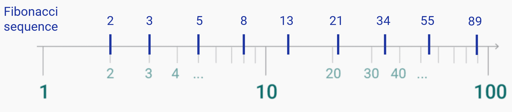
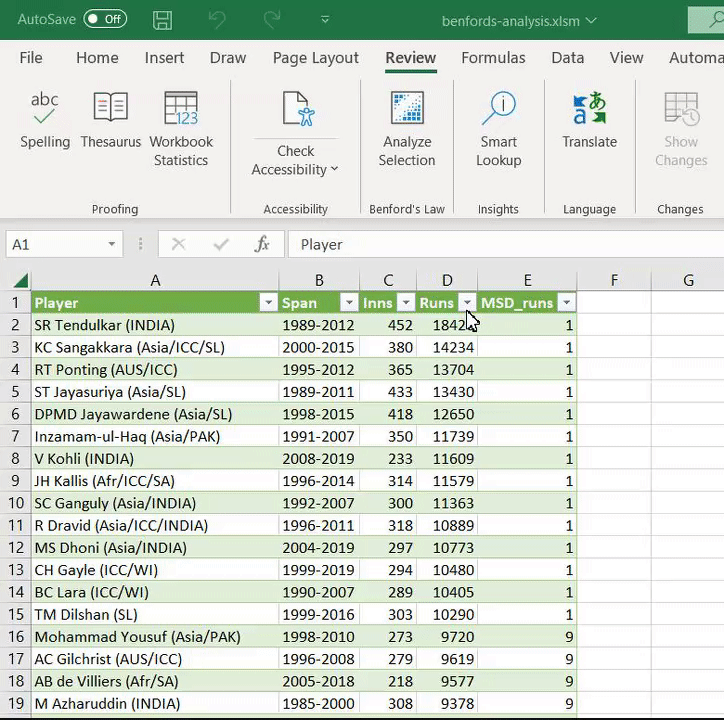
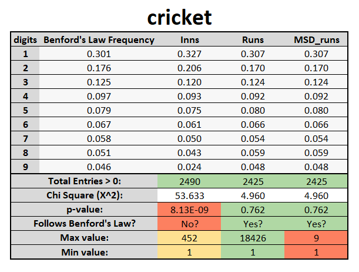

<head>
    <link rel="stylesheet" href="custom-style.css">
</head>

# Program Name

## Table of Contents

<!-- no toc -->
- [1. Introduction](#1-introduction)
- [2. Theory](#2-theory)
  - [2.1. Definition](#21-definition)
  - [2.2. Explanation](#22-explanation)
  - [2.3. Frequencies for each digit](#23-frequencies-for-each-digit)
  - [2.4. Uses and notes](#24-uses-and-notes)
- [3. Installation](#3-installation)
  - [3.1. Adding macro to Menu](#31-adding-macro-to-menu)
- [4. Usage](#4-usage)
  - [4.1. Dataset Requirements](#41-dataset-requirements)
  - [4.2. Usage Guide](#42-usage-guide)
    - [4.2.1 Benford's Report - Table](#421-benfords-report---table)
    - [4.2.2 Benford's Report - Plot](#422-benfords-report---plot)
- [5. Examples](#5-examples)
- [6. Credits](#6-credits)

## 1. Introduction

Welcome to the Benford's Law Excel Macro! This program is designed to make it easy and quick to apply Benford's Law to any dataset. 

Benford's Law is a statistical principle that predicts the frequency of digits in sets of numerical data. It states that in many real-world datasets, the leading digit is likely to be a small number. For example, in a dataset of prices, the number "1" is likely to be the leading digit more often than any other number. 

This macro allows you to quickly and easily analyze your own data to see if it follows Benford's Law. Simply input your data into an Excel spreadsheet and run the macro to get a report on the distribution of leading digits in your dataset. 

Whether you're a researcher, a data analyst, or just curious about Benford's Law, this macro is a useful tool for understanding and analyzing numerical data.

## 2. Theory

### 2.1. Definition

Benford's Law is a statistical principle that states that in many real-world datasets, the leading digit (the leftmost digit) is likely to be a small number.

For example, in a set of numbers that represent the population sizes of cities, it is more likely that a city will have a population starting with the digit 1 (such as 10,000 or 100,000) than a population starting with the digit 9 (such as 90,000 or 900,000). 

### 2.2. Explanation

This phenomenon can be explained by the fact that many real-world datasets are distributed along a logarithmic scale.

On a logarithmic scale, numbers are evenly spaced out in terms of their orders of magnitude. For example, the distance between 1 and 10 is the same as the distance between 10 and 100. This means that leading digits are distributed in the exact same way in every order of magnitude.

Another property of logarithmic scale is that regions that start with a smaller leading digit (such as 1, 2 or 3) are much wider than regions that start with a larger leading digit (such as 7, 8 or 9). This makes it more likely for numbers of a dataset that is spread across multiple orders of magnitude to fall into regions with smaller leading digits.

  </img> 

### 2.3. Frequencies for each digit

Benford's Law can be expressed mathematically as follows:

$$ P(d) = \log_{10} \left( 1 + \frac{1}{d} \right) $$

where `P(d)` is the probability that a number will have the digit `d` as its leading digit and `d` is a digit from 1 to 9.

The following table lists the frequencies of each digit according to Benford's Law:

| Digit | Frequency |
|-------|-----------|
| 1     | 30.1%     |
| 2     | 17.6%     |
| 3     | 12.5%     |
| 4     | 9.7%      |
| 5     | 7.9%      |
| 6     | 6.7%      |
| 7     | 5.8%      |
| 8     | 5.1%      |
| 9     | 4.6%      |

### 2.4. Uses and notes

Benford's Law has been found to hold true for a wide variety of datasets, including financial data, population data, and physical constants. It can be used as a tool for detecting fraudulent or anomalous data, as well as for understanding the underlying distribution of values in a dataset. It is important to note that Benford's Law is not a perfect prediction and may not hold true for all datasets, but it can still be a useful tool for understanding and analyzing numerical data.

## 3. Installation

Installing the Excel macro is easy! Simply follow these steps:

1. Download the `.xla` file from github **[AÑADIR LINK]**
2. Open Microsoft Excel on your computer.
3. Go to the **File** menu and select **Options**.
4. In the **Options** window, select **Add-Ins** from the list on the left.
5. In the **Manage** dropdown menu at the bottom of the window, select **Excel Add-ins** and click **Go**.
6. In the **Add-Ins** window, click the **Browse** button.
7. Navigate to the location where you saved the `.xla` file and select it.
8. Click **OK** to install the macro.

Once the installation is complete, the macro will be available for use in any Excel workbook. To use the macro, you can either select it from the **Macros** dropdown menu on the **View** tab, or you can add it to the ribbon for easy access.

### 3.1. Adding macro to Menu

To add the macro to the ribbon, follow these steps:

1. Go to the **File** menu and select **Options**.
2. In the **Options** window, select **Customize Ribbon** from the list on the left.
3. In the **Customize the Ribbon** window, click the **New Group** button on the right side of the "Review" tab.
4. In the **New Group** window, give the group a name (such as "Benford's Law") and click **OK**.
5. In the **Customize the Ribbon** window, select the new group you just created and click the **Add>>** button.
6. In the **Choose commands from** dropdown menu, select **Macros**.
7. From the list of available macros, select `MACRO_NAME` and click **Add>>**.
8. Click **OK** to save your changes.

Now the macro will be available on the "Review" tab in the new group you created. Simply click the button to run the macro and apply Benford's Law to your dataset.

That's it! You're now ready to start using the Excel macro to easily and quickly apply Benford's Law to your datasets.

## 4. Usage

### 4.1. Dataset Requirements

Benford's Law is a statistical principle that can be used to analyze a dataset to determine whether it is likely to be a random, natural dataset or whether it has been artificially manipulated. In order to analyze a dataset with Benford's Law, the following requirements should be met:

1. The dataset should be large enough to be statistically significant. Benford's Law is based on the idea that large datasets follow a predictable pattern, so it is important to have a large enough sample size to accurately apply the law.

2. The dataset should be numeric and continuous. Benford's Law is based on the distribution of the first digits of numbers, so the dataset must consist of numeric values that can be analyzed in this way. The values should also be continuous, rather than discrete or categorical, in order to accurately apply the law.

3. The data should be collected from a natural or random source. Benford's Law is most effective when applied to datasets that are generated naturally or randomly, rather than artificially manipulated.

4. The data should be unbiased. The data should not be influenced by any external factors or biases that could affect the distribution of the first digits.

5. The data should be independent. Each data point should be independent of the others, meaning that it should not be influenced by or related to any other data points in the dataset.

Overall, a dataset that meets these requirements is more likely to be accurately analyzed using Benford's Law, and the results of the analysis will be more reliable and meaningful.

### 4.2. Usage Guide

1. As soon as we run the macro `MACRO NAME` we will be asked to select which cells we want to analyze. 
   
   The recommended action will be to select every full column in which we are interested. 
   
   You can also just focus on a specific set of rows but remember that is better to analyze as many values as possible for the statistical tests to be significant.

2. When we confirm our selection, a new Excel worksheet will appear with the name `Benford's Report`. In this worksheet we will find a table and a plot which I will describe separately.
   
  </img>

#### 4.2.1 Benford's Report - Table

The table is the most important part of this generated worksheet. It not only contains the expected and observed frequencies for each most significant digit on every column we chose to analyze, but also some suggestions on how to interpret the results.

In the "suggestion" module of the table, users are presented with three valuable insights to consider when analyzing their data. 

The first recommendation is the number of entries analyzed, which should be as high as possible in order to increase the significance of the statistical tests. 

Next, a chi square test is presented, complete with the chi square value, the corresponding p-value, and an interpretation of the p-value that reveals whether the observed frequency aligns with the expected frequency or not. 

Lastly, users are provided with the minimum and maximum values observed, offering a comprehensive overview of the range of values present in the data. If the range of values is not very large, Benford's Law may not be applicable to the dataset. 

After performing the tests, we have gained some insights into whether each column follows Benford's law or not. However, it is important to note that Benford's law may not always be applicable to every dataset, even if the tests indicate that it follows the law. Therefore, it is recommended to carefully analyze and verify the results for yourself to determine the appropriateness of using Benford's law for your specific dataset.

</img>

#### 4.2.2 Benford's Report - Plot

The plot on this slide is a grouped column chart that compares the expected frequencies predicted by Benford's Law, represented in orange, with the observed frequencies from our dataset, represented in a colorblind friendly color scale of blue. 

The specific shade of blue used for the observed frequencies is chosen dynamically based on the number of observations. Orange and blue are complementary colors, which helps to make the chart easier to read and interpret. 

By comparing the expected frequencies to the observed frequencies from our dataset, we can determine how closely the actual data follows Benford's Law and identify any deviations from the expected pattern. 

This chart allows us to easily visualize and analyze these differences, helping us to understand any patterns or trends that may be present in our data.

</img>

## 5. Examples

This example will explaing the walkthrough of executing this macro on a dataset with cricket runs from different players. The columns are the following:

* Player: *(text)* This column represents the name of the cricket player.
* Span: *(date)* This column represents the range of years in which the player played One Day International (ODI) matches.
* Inns: *(numeric)* This column represents the number of innings played by the player. An inning is a period of play in a cricket match during which one team takes its turn to bat.
* Runs: *(numeric)* This column represents the number of runs scored by the player in ODI matches. In cricket, a run is scored when the batsman hits the ball and runs to the other end of the pitch, or when runs are awarded as a result of an error or penalty by the fielding team.
* MSD_runs: *(numeric)* Most significant digit (leftmost digit) of "Runs" column.

In this dataset the only columns we are able to analyze are the last three, the numeric ones.

</img>

</img>

Now that we have our results, by looking at the table we can extract the following information for each of the columns we chose:

* Inns: Number of numeric entries > o are enough. Goodnes of Fit result says it very unlikely for this column to follow Benford's Law.
* Runs: Numeric entries greater than zero are also acceptable here. The p-value do not suggest that the observed frequency does not follow Benford's Law and the difference between orders of magnitude is significant. At a first glance, the number of runs of each different player appears to follow the distribution.
* MSD_runs: For numeric entries and Goodnes of Fit test we get the exact same results as the previous column. But the difference between orders of magnitude is not acceptable as we are only checking digits here (1-9) so even tho the tests return promising results, it does not make sense to look for Benfordness here.

</img>

On the plot we can confirm that the first "Inns" column, eventho is quite similar, its not following the distribution as close as we would expect.

We can also notice that as we mentioned, both "Runs" and "MSD_runs" present the exact same distribution, but because of the information from the table we should only focus on the "Runs" column.

## 6. Credits

This Macro has been coded by Luis Rodríguez Rubio for a 10 ECTS project at Aarhus University and has been supervised by Hans Jörg Schulz.

This project was aligned with the Data Visualization course of the Computer Science Master's Degree.